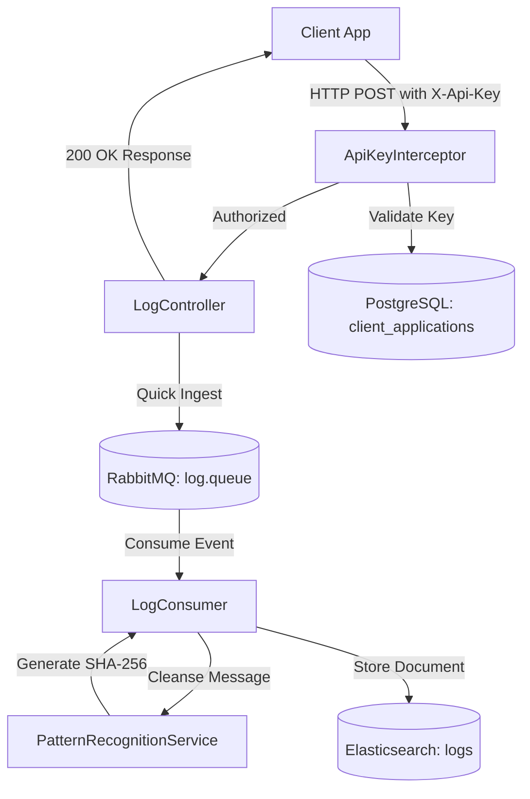

# 📊 LogMetric-API

[](https://www.oracle.com/java/)
[](https://spring.io/projects/spring-boot)
[](https://www.rabbitmq.com/)
[](https://www.elastic.co/)
[](https://www.postgresql.org/)

LogMetric-API is a **high-performance, asynchronous log ingestion, pattern recognition, and clustering engine** built using Spring Boot. It leverages a modern, distributed architecture to ingest logs under ultra-low latency, extract patterns, cluster similar log streams, and index them in real-time for comprehensive analytics and telemetry.

---

## 🏗️ Architecture & Workflow

LogMetric-API uses an asynchronous, message-driven architecture to ensure that log ingestion is decoupled from processing and storage, preventing blocking operations under heavy loads.



1. **Ingestion & Validation**: Clients send log payloads via a REST controller authorized by an API key header (`X-Api-Key`), validated against metadata stored in **PostgreSQL**.
2. **Buffering**: The controller registers the request and immediately pushes the log entry onto **RabbitMQ** (`log.queue`), sending a success response back to the client in milliseconds.
3. **Consumption & Pattern Recognition**: A background worker thread (`LogConsumer`) retrieves messages from RabbitMQ and runs them through a dynamic pattern cleanser. Numbers are extracted and normalized to `{Number}` templates to identify recurring log classes.
4. **Hashing & Clustering**: The normalized template is hashed via SHA-256 to assign a unique `patternHash` signature.
5. **Real-time Indexing**: The final structured log entry, adorned with its pattern hash, is stored in **Elasticsearch** for high-speed indexing, search, and analysis.

---

## 🛠️ Technology Stack

- **Framework**: Spring Boot 4.0.6 (Spring Web MVC)
- **Message Broker**: RabbitMQ (Spring AMQP)
- **Search & Analytics**: Elasticsearch (Spring Data Elasticsearch)
- **Relational Storage**: PostgreSQL (Spring Data JPA / Hibernate)
- **Object Mapping & Parsing**: Jackson Databind
- **Database Driver**: PostgreSQL JDBC

---

## 📂 Project Structure

```
LogMetric-API/
├── src/main/java/org/example/logmetricapi/
│   ├── LogMetricApiApplication.java       # Main entry point
│   ├── LogController.java                # Log Ingestion REST API Controller
│   ├── LogEntry.java                     # Elasticsearch Document / Log Entity model
│   ├── LogConsumer.java                  # RabbitMQ Message Listener & processor
│   ├── PatternRecognitionService.java    # Text Cleanser & Hashing logic
│   ├── LogRepository.java                # Elasticsearch Repository interface
│   ├── ClientApplication.java            # PostgreSQL JPA Entity for Authorized Clients
│   ├── ClientApplicationRepository.java  # PostgreSQL JPA Repository
│   ├── ApiKeyInterceptor.java            # Request Interceptor for API security
│   ├── ElasticsearchConfig.java          # Elasticsearch client configuration
│   └── RabbitConfig.java                 # RabbitMQ Exchange/Queue definitions
└── src/main/resources/
    └── application.properties             # Database, broker & environment configurations
```

---

## 🚀 Setup & Installation

### 1. Prerequisites
Ensure you have the following services installed and running:
* **Java 17+** & **Maven 3.8+**
* **PostgreSQL** (Port: `5432`, Database: `logmetric`)
* **RabbitMQ** (Port: `5672`)
* **Elasticsearch** (Port: `9200`)

### 2. Configure Database & Services
Update the database connection properties in `src/main/resources/application.properties`:
```properties
spring.datasource.url=jdbc:postgresql://localhost:5432/logmetric
spring.datasource.username=your_postgres_username
spring.datasource.password=your_postgres_password
```

By default, the application connects to:
* **RabbitMQ** at `localhost:5672` (using default credentials)
* **Elasticsearch** at `localhost:9200` (non-authenticated / local dev node)

### 3. Run the Application
Compile the codebase and launch the Spring Boot service:
```bash
mvn clean install
mvn spring-boot:run
```

---

## 🔌 API Endpoints Reference

### 1. Ingest Log Entry
* **Endpoint**: `POST /api/logs`
* **Headers**:
  * `Content-Type: application/json`
  * `X-Api-Key: <your-client-api-key>`
* **Request Body**:
```json
{
  "id": "log-unique-uuid-101",
  "timestamp": 1787123984000,
  "level": "ERROR",
  "serviceName": "auth-service",
  "message": "Failed connection attempt for user 4983 from IP 192.168.1.1",
  "userId": "usr_4983"
}
```

* **Processing Details**:
  * The message is cleansed by replacing numeric digits: `"Failed connection attempt for user {Number} from IP {Number}.{Number}.{Number}.{Number}"`
  * A unique SHA-256 signature is generated: e.g., `8d2279b...f3`
  * The entry is pushed to Elasticsearch with the assigned `patternHash`.

* **Success Response**:
  * **Code**: `200 OK`
  * **Content**: `"200 OK - Log Ingested Successfully"`

### 2. Search Logs by Level
* **Endpoint**: `GET /api/logs?level=ERROR`
* **Query Params**: `level` (optional)
* **Status**: 🛠️ *Currently undergoing Elasticsearch integration migration* (returns temporary maintenance message).

---

## 🔒 Security
Log security is enforced through a lightweight, high-performance Interceptor (`ApiKeyInterceptor`) that checks incoming requests for a valid `X-Api-Key` header.
To register new clients and allocate API keys, insert entries into the `client_applications` table in the PostgreSQL database:
```sql
INSERT INTO client_applications (id, name, api_key) 
VALUES (1, 'Payment Gateway Client', 'pmt_gw_sec_key_xyz987');
```

---

## 📈 Future Enhancements
- [ ] Migrate the `GET /api/logs` search endpoint to search Elasticsearch indexes directly using native Query DSL.
- [ ] Implement an automated Web Dashboard to monitor log pattern distribution in real-time.
- [ ] Add support for custom masking patterns (e.g., credit cards, email addresses).
