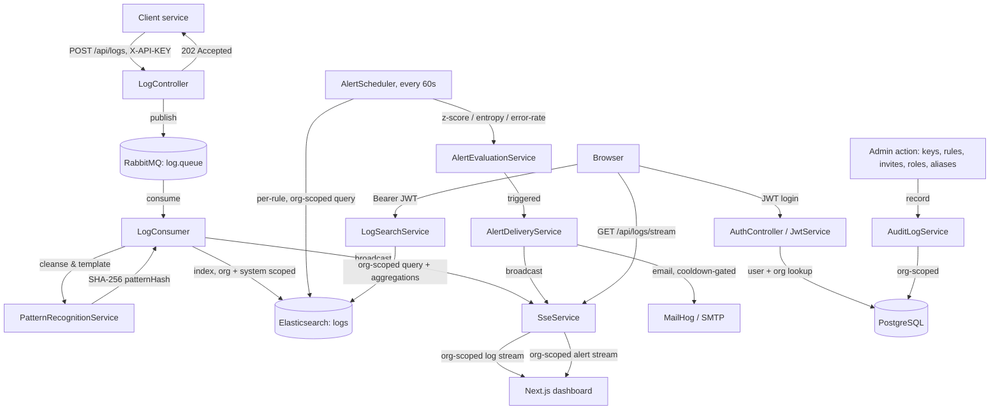

# 📊 LogMetric

[](https://www.oracle.com/java/)
[](https://spring.io/projects/spring-boot)
[](https://nextjs.org/)
[](https://react.dev/)
[](https://www.rabbitmq.com/)
[](https://www.elastic.co/)
[](https://www.postgresql.org/)

LogMetric is a **multi-tenant log telemetry platform**: organizations ingest log events over a
hashed, per-system API key, the backend clusters them by structural pattern (a SHA-256 hash of
each message with its variables stripped out) using an asynchronous RabbitMQ → Elasticsearch
pipeline, and a full Next.js dashboard streams them back in real time — search, pattern clusters,
live tail, real anomaly-based alerting, and team management, all scoped strictly to the caller's
own organization.

It started as a small ingestion API and grew into a full-stack product: JWT + API-key auth,
role-based access control, invite-based team onboarding with OTP email verification and
self-service password reset, a true `Organization → System → ApiKey` tenant hierarchy, rule-driven
alerting with real email/SSE delivery, an admin audit log, and a from-scratch three-theme frontend
(Midnight / Daylight / Amber CRT) covering ten routes, audited to zero axe-core accessibility
violations and responsive from 375px to 1920px.

**Release status (v1.0, multi-tenant rewrite):** the platform is functionally complete against the
scope below and has an authored QA test plan of 155 test cases across 20 modules — see
[🧪 Testing & QA](#-testing--qa).

---

## 🏗️ Architecture


```mermaid
graph TD
    Client[Client service] -->|POST /api/logs, X-API-KEY| LC[LogController]
    LC -->|202 Accepted| Client
    LC -->|publish| RMQ[(RabbitMQ: log.queue)]

    RMQ -->|consume| LCons[LogConsumer]
    LCons -->|cleanse & template| PRS[PatternRecognitionService]
    PRS -->|SHA-256 patternHash| LCons
    LCons -->|index, org + system scoped| ES[(Elasticsearch: logs)]
    LCons -->|broadcast| SSE[SseService]

    SSE -->|org-scoped log stream| UI[Next.js dashboard]

    Sched[AlertScheduler, every 60s] -->|per-rule, org-scoped query| ES
    Sched -->|z-score / entropy / error-rate| AES[AlertEvaluationService]
    AES -->|triggered| ADS[AlertDeliveryService]
    ADS -->|email, cooldown-gated| Mail[MailHog / SMTP]
    ADS -->|broadcast| SSE
    SSE -->|org-scoped alert stream| UI

    Browser[Browser] -->|JWT login| Auth[AuthController / JwtService]
    Auth -->|user + org lookup| PG[(PostgreSQL)]
    Browser -->|Bearer JWT| Search[LogSearchService]
    Search -->|org-scoped query + aggregations| ES
    Browser -->|GET /api/logs/stream| SSE

    Admin[Admin action: keys, rules, invites, roles, aliases] -->|record| Audit[AuditLogService]
    Audit -->|org-scoped| PG
```

1. **Ingestion** — a client posts a log with its per-system API key; the request is accepted
   (202) and handed off to RabbitMQ, so ingestion never blocks on indexing.
2. **Processing** — `LogConsumer` cleanses the message, `PatternRecognitionService` strips
   variables and hashes what's left into a `patternHash`, and the enriched, org/system-scoped
   document lands in Elasticsearch.
3. **Delivery** — the same event is broadcast on an org-scoped SSE channel for the live tail, and
   evaluated on the next 60-second alert tick against every enabled rule for that organization.
4. **Read path** — every search, aggregation, and stream the dashboard makes is scoped server-side
   to the organization (and, for the pattern/analytics views, the system) derived from the
   authenticated JWT — never from a client-supplied parameter.

---

## 📁 Repository structure

```
├── src/main/java/org/example/logmetricapi/
│   ├── controller/       AuthController, LogController, SystemController, AlertRuleController,
│   │                     InviteController, UserController, ServiceAliasController,
│   │                     AuditLogController, DeploymentController, PatternController, ...
│   ├── service/          LogSearchService, LogAnalyticsService, PatternRecognitionService,
│   │                     JwtService, ApiKeyService, InviteService, OtpService, MailService,
│   │                     AlertEvaluationService, AlertDeliveryService, AuditLogService,
│   │                     SseService, CustomUserDetailsService, DatabaseSeeder, LoginAttemptService,
│   │                     ParameterStatsService, CompressionAnalyticsService
│   └── util/             AuthUtils (principal → organizationId/systemId/User resolution), HashUtil
├── src/test/java/org/example/logmetricapi/   JUnit 5 + MockMvc unit & integration tests
├── src/main/resources/application.properties
├── docker-compose.yml    Postgres · RabbitMQ · Elasticsearch · MailHog
├── demo/                 Demo-data generator + live credential-stuffing simulator (see demo/README.md)
├── LogMetric_Test_Cases.xlsx   155-case manual/automated QA test plan (see Testing & QA below)
└── logmetric-ui/
    └── app/
        ├── page.tsx, signin/, signup/,
        │   forgot-password/, reset-password/,
        │   verify-email/, terms/, privacy/            public routes
        ├── dashboard/, explorer/, patterns/,
        │   alerts/, settings/, team/, audit/           authenticated routes
        ├── components/{ui,charts,explorer,patterns,alerts,settings,team}/
        └── lib/          api.ts, auth.tsx, theme.tsx, useLogSearch.ts, useMediaQuery.ts
```

---

## 🚀 Setup & Installation

### 1. Start infrastructure
```bash
docker compose up -d      # Postgres :5432, RabbitMQ :5672 (+:15672 UI), Elasticsearch :9200,
                           # MailHog :1025 (SMTP) / :8025 (web UI -- inspect OTP/alert emails here)
```

### 2. Configure environment
Set a strong `JWT_SECRET` (≥32 bytes, raw UTF-8 — not Base64) — the app fails fast at startup
without one, in every environment including local dev:
```bash
export JWT_SECRET=$(openssl rand -hex 32)
```
Database credentials and mail settings live in `src/main/resources/application.properties`
(defaults already point at the MailHog container above for local dev).

### 3. Run the backend
```bash
./mvnw spring-boot:run    # :8081
```
On first boot against an empty database, `DatabaseSeeder` prints a ready-to-use admin login
(`admin@logmetric.local` / `admin12345` by default, overridable via `SEED_ADMIN_PASSWORD`) and a
seeded API key. The seeded admin's email is pre-verified, so it skips the OTP step every other
account goes through. Disabled outside the `!prod` profile.

### 4. Run the frontend
```bash
cd logmetric-ui
npm install
npm run dev                # :3000, reads NEXT_PUBLIC_API_URL from .env.local
```
Copy `.env.example` to `.env.local` first. Leave `NEXT_PUBLIC_DEMO_MODE` unset or `false` for a
real deployment against the backend above — it's provided only for a static marketing preview
with no backend and synthetic data.

---

## ✨ What's built

- **Multi-tenancy, enforced server-side on every read path.** Search, live streaming, and every
  aggregation filter on the organization derived from the authenticated principal. A true
  `Organization → System → ApiKey` hierarchy means every ingested log also carries a server-derived
  `systemId` a client can never override; System CRUD is admin-gated for writes, org-wide for reads.
- **Auth & onboarding.** JWT login/register, duplicate-email and weak-org-name protection,
  invite-token-based team onboarding (a second person can only join an org via an admin-issued
  invite — open "join by org name" was a real vulnerability, closed early on), with a full
  list/revoke lifecycle for outstanding invites.
- **OTP-based email verification & password reset.** Both signup paths require a 6-digit, emailed,
  BCrypt-hashed, single-use code before login is allowed (10-minute expiry, 5-attempt cap, 60s
  resend cooldown); forgot/reset-password reuses the same infrastructure with enumeration-resistant
  responses. Logged-in users can also change their password directly, and admins can rename their
  organization inline.
- **RBAC.** `ADMIN`/`USER` roles gate every mutating endpoint (keys, systems, alert rules, invites,
  role changes, org rename, service aliases, audit log), enforced via `@PreAuthorize` and
  re-checked fresh from the database on every request.
- **Ingestion pipeline.** API-key-authenticated `POST /api/logs`, org/system stamped server-side,
  async via RabbitMQ, SHA-256 pattern-clustered on the way into Elasticsearch.
- **Search & analytics.** Keyword, level, service, pattern-hash, and time-range filters; a date
  histogram whose bucket width (and axis label) scales with the requested span; severity and
  service-name aggregations; brush-to-zoom on the histogram; admin-editable display aliases for
  the free-text service names logs actually carry.
- **Real alerting.** Org-scoped `AlertRule`s (error rate, EMA z-score volume spikes, Shannon-entropy
  payload obfuscation, new patterns, pattern silence, and parameter cardinality), each with its own
  threshold, window, and recipient list validated against real org members. A rule-driven scheduler
  evaluates every 60s and delivers through email (single digest, cooldown-gated) and a live SSE
  feed. A real rule editor on `/alerts` gives admins full CRUD, enable/disable, and a recipient
  multi-select — not a placeholder.
- **Pattern clustering UI.** A dedicated `/patterns` view groups events by structural template —
  "342 events across 4 services," not 342 near-identical rows — with per-cluster drill-down.
- **Topology visualization.** A dedicated `/topology` page visualizes the `Organization → System`
  hierarchy — each system card shows its creation date, live severity distribution, top services by
  volume, and active API key count, with quick links to drill into each system's logs in the
  Explorer.
- **Compression & cost analytics.** A dedicated analytics panel showing aggregate statistics: total
  log events, distinct structural templates, events-per-template ratio, projected storage savings,
  and top 5 patterns by volume — giving ops teams immediate visibility into compression gains from
  pattern clustering.
- **Deploy markers.** Overlay visual markers (dashed lines) aligned with log timestamps on the
  ingest volume histogram, dynamically matched to the active date range.
- **Real-time live tail.** Org-scoped Server-Sent Events with scroll anchoring (new rows don't yank
  you away from what you're reading), pause/buffer, and automatic reconnect with capped exponential
  backoff if the connection drops.
- **Team management.** Invite teammates, promote/demote admins, list/revoke outstanding invites,
  with every guard condition (can't demote yourself, can't demote the org's last admin, cross-org
  IDs 404 rather than leaking existence) surfaced as a specific message.
- **Audit log.** Every login and admin action is recorded org-scoped and readable on `/audit`
  (paginated), with an admin-controlled retention purge — no silent background sweep.
- **Settings.** Self-service API key generation with a ready-to-run curl snippet (the raw key is
  shown exactly once, since it's stored hashed and cannot be retrieved again) plus a list of
  existing keys' metadata; organization rename; password change; service display aliases.
- **Parameter intelligence.** The system tracks parameter cardinality per pattern — distinct count
  of variable values seen in each log position — enabling anomaly detection when a parameter
  suddenly exhibits explosive growth (a sign of ID injection, regex explosion, or memory leaks).
  Integrated into the `PARAM_CARDINALITY` alert metric and backed by a time-windowed stats service
  to cap memory overhead.
- **Login rate limiting.** Per-email and per-IP brute-force protection on `/auth/login`: 5 failed
  attempts lock an email or IP for 15 minutes, preventing credential stuffing and guessing attacks.
- **Frontend polish.** Three complete themes with a validated, colour-vision-deficiency-checked
  status palette; a command palette (Ctrl+K); responsive from 375px to 1920px, including a
  bottom-sheet presentation for drawers/filters on mobile; virtualized log tables above 200 rows;
  zero axe-core accessibility violations across all routes and themes; honest empty/loading/error
  states everywhere (a dead backend is never visually indistinguishable from an empty org).

## 🚧 Not yet built

- **Per-user system monitoring assignment.** Unblocked (Systems exist) but explicitly deprioritized:
  narrowing read access from "whole org" to "assigned systems only" would need to be enforced in
  every read path (search, SSE, every aggregation), and a half-applied version of that is worse
  than not having it.

---

## 📈 Roadmap

What's left is narrow: per-user system monitoring assignment — unblocked but deliberately
deprioritized, since a half-applied second scoping layer would be worse than the current,
fully-tested org-level boundary. See "Not yet built" above.

---

## 🔌 API Reference

All endpoints are under `/api`. JWT endpoints expect `Authorization: Bearer <token>`; ingestion
uses `X-API-KEY: <key>` instead.

| Method | Path | Auth | Purpose |
|---|---|---|---|
| POST | `/auth/register` | none | Create an org + admin user; issues an email verification code |
| POST | `/auth/register-with-invite` | none | Join an org via invite code as `USER`; same verification |
| POST | `/auth/verify-email` | none | Confirm the 6-digit signup code; returns a JWT |
| POST | `/auth/resend-verification` | none | New code, subject to a 60s cooldown |
| POST | `/auth/login` | none | Returns a JWT (403 if the account isn't verified yet) |
| POST | `/auth/forgot-password` | none | Always 200; issues a reset code if the address is registered |
| POST | `/auth/reset-password` | none | Resets the password with a valid code |
| POST | `/auth/change-password` | JWT | Change your own password (requires the current one) |
| GET | `/auth/me` | JWT | Current user's fresh role/org (not the JWT's stale claim) |
| PATCH | `/organizations` | JWT, `ADMIN` | Rename the caller's own organization |
| POST | `/logs` | API key | Ingest one log event (202 Accepted) |
| POST | `/logs/search` | JWT | Org-scoped search + aggregations |
| GET | `/logs/stream` | JWT | Org-scoped SSE live tail |
| POST | `/systems` | JWT, `ADMIN` | Create a system |
| GET | `/systems` | JWT | List the org's systems |
| DELETE | `/systems/{id}` | JWT, `ADMIN` | Delete a system |
| POST | `/systems/{id}/keys` | JWT, `ADMIN` | Generate an API key for a system (shown once) |
| GET | `/keys` | JWT, `ADMIN` | List key metadata (masked hint, system, revoked) |
| GET | `/alert-rules` | JWT, `ADMIN` | List the org's alert rules |
| POST | `/alert-rules` | JWT, `ADMIN` | Create a rule |
| PUT | `/alert-rules/{id}` | JWT, `ADMIN` | Replace a rule |
| DELETE | `/alert-rules/{id}` | JWT, `ADMIN` | Delete a rule |
| GET | `/alerts/stream` | JWT | Org-scoped SSE feed of triggered alerts |
| POST | `/invites` | JWT, `ADMIN` | Generate a 7-day single-use invite code |
| GET | `/invites` | JWT, `ADMIN` | List outstanding invites |
| DELETE | `/invites/{id}` | JWT, `ADMIN` | Revoke an unredeemed invite |
| GET | `/users` | JWT, `ADMIN` | List the caller's org members |
| PATCH | `/users/{id}/role` | JWT, `ADMIN` | Promote or demote a teammate |
| GET | `/service-aliases` | JWT | List the org's service display aliases |
| PUT | `/service-aliases` | JWT, `ADMIN` | Set or replace a service's display alias |
| DELETE | `/service-aliases` | JWT, `ADMIN` | Clear a service's display alias |
| GET | `/audit-logs` | JWT, `ADMIN` | Paginated, org-scoped audit history |
| DELETE | `/audit-logs` | JWT, `ADMIN` | Purge audit entries older than `olderThanDays` |
| POST | `/deployments` | JWT, `ADMIN` | Record a new system deployment marker |
| GET | `/deployments` | JWT | List deployments matching a date range |
| GET | `/deployments/{id}/new-patterns` | JWT | List new log patterns seen since a specific deployment |
| GET | `/patterns` | JWT | List org-scoped log patterns (clusters) sorted by volume/new/recent; paginated |
| GET | `/analytics/compression` | JWT | Org-scoped compression stats: total events, distinct templates, events-per-template, projected savings, top 5 patterns by volume |

### Example: ingest a log
```bash
curl -X POST http://localhost:8081/api/logs \
  -H "X-API-KEY: <your-api-key>" \
  -H "Content-Type: application/json" \
  -d '{"level":"ERROR","serviceName":"auth-service","message":"Failed login for user 4983 from 192.168.1.1"}'
```
The message above and one for user `9021` from a different IP both hash to the same
`patternHash` — the numbers are template variables, not part of the pattern's identity.

---

## 🔒 Security

- **Two independent auth mechanisms**, both enforced in one Spring Security filter chain: JWT
  (HS384, ≥32-byte secret required at startup) for the dashboard, hashed API keys for ingestion.
- **Every read is org-scoped server-side.** `AuthUtils` resolves the caller's `organizationId`
  (and, for API keys, `systemId`) from the authenticated principal — never from a request
  parameter — and every controller, service query, and SSE subscription is required to use it.
- **RBAC via `hasAuthority`, not `hasRole`** — `User.getAuthorities()` returns bare `ADMIN`/`USER`
  with no `ROLE_` prefix, so `hasRole(...)` would silently never match.
- **OTP hygiene.** Signup and password-reset codes are 6-digit, `SecureRandom`-generated,
  BCrypt-hashed, single-use, capped at 5 attempts, and rate-limited by a 60s resend cooldown. Every
  enumeration-sensitive endpoint (`resend-verification`, `forgot-password`) returns an identical
  response regardless of whether the address exists.
- **Clean 401/403 bodies** from a dedicated `AuthenticationEntryPoint`/`AccessDeniedHandler` pair,
  including for malformed or tampered JWTs (caught explicitly, not left to crash as a 500).
- **Cross-org lookups 404, not 403** — a user/invite/system/rule ID from another org reads as "not
  found," not "forbidden," so an attacker can't use the response to confirm an ID exists elsewhere.
- **Recipient validation on alert rules.** A rule's email recipients must belong to a real member
  of the caller's own org, rejected by name otherwise — closing what would be an open relay for
  exfiltrating alert content (which can include log excerpts).
- **Login rate limiting.** 5 failed attempts lock an email or IP for 15 minutes.
- **Audit trail.** Every login and admin mutation is recorded org-scoped, so "who generated this
  key" or "who changed this role" has an answer.
- **Known, intentional limitation:** JWTs are stateless with no server-side revocation, so a
  session issued before a password change or reset remains valid until it naturally expires.
- Automated tenant-isolation and RBAC regression tests run as part of `./mvnw verify`.

---

## 🧪 Testing & QA

Two layers of testing back this project: an automated suite that runs on every build, and a
broader, manually-authored QA test plan (`LogMetric_Test_Cases.xlsx`) that also exercises what
automation can't — UI/accessibility, load, and exploratory security cases.

### Automated suite
```bash
./mvnw verify
```
115+ tests across dependency-free unit tests (`JwtServiceTests`, `PatternRecognitionServiceTests`,
`LogAnalyticsServiceTests`) and full-stack integration tests requiring `docker compose up -d`:
`TenantIsolationAndRbacTests` (two orgs, two API keys — asserts one can never read the other's data
via search, SSE, or any admin endpoint; every `ADMIN`-gated endpoint 403s a `USER` JWT and an
API-key principal, 200s an `ADMIN`), `EmailVerificationTests`, `ForgotPasswordTests`,
`ChangePasswordTests`, `OrganizationRenameTests`, `ServiceAliasTests`, `AlertRuleTests`,
`AlertEvaluationAndDeliveryTests`, `AuditLogTests`, `AbandonedSignupReclaimTests`,
`LoginRateLimitTests`, `SystemDeletionAndKeyRevocationTests`, `DeploymentTests`,
`PatternRegistryTests`, `NewPatternAlertTests`, `SilenceAlertTests`, `ParameterIntelligenceTests`,
and `CompressionAnalyticsTests`.

### QA test plan (`LogMetric_Test_Cases.xlsx`)
A 155-case manual/automated test plan, revised 2026-08-10 to cover the full multi-tenant rewrite
(JWT + RBAC, OTP onboarding, invites, rule-driven alerting, audit log, service aliases,
deployments, pattern registry, and parameter-cardinality intelligence). Where a case is already
covered by `./mvnw verify`, the sheet names the real JUnit class to run instead of re-testing by
hand.

**Pre-conditions:** full stack up via `docker compose up -d` (Postgres, RabbitMQ + management UI
on `:15672`, Elasticsearch 8.x, MailHog on `:1025`/`:8025`), the backend running with a valid
`JWT_SECRET`, and the frontend served at `http://localhost:3000`. Team-onboarding cases additionally
need an admin-generated invite code; OTP-gated cases need the emailed code from MailHog's web UI.

| Breakdown | Detail |
|---|---|
| **Total cases** | 155 |
| **Priority** | High 83 · Medium 62 · Low 10 |
| **Layer** | Backend 128 · Frontend 27 |
| **Execution method** | Automated 98 · Manual 55 · Hybrid 2 |
| **Coverage areas** *(a case may span more than one)* | Functional 66 · Security 47 · Database 23 · UI 28 · Performance 10 · Resilience 12 · Analytics 12 · Negative 9 · Regression 7 · Integration 11 · RBAC 5 · Unit 8 · Boundary 1 · Onboarding 2 · Usability 6 · User Acceptance 2 |

**Modules (A–T):**

| Module | Cases |
|---|---|
| A. Authentication, onboarding & OTP | TC-001–012 (12) |
| B. RBAC, tenant isolation & organization management | TC-013–020 (8) |
| C. Ingestion gateway & payload validation | TC-021–032 (12) |
| D. Messaging & asynchronous decoupling | TC-033–038 (6) |
| E. Pattern recognition & hashing | TC-039–046 (8) |
| F. Alert rules & alerting engine | TC-047–059 (13) |
| G. Search, live streaming (SSE) & query analytics | TC-060–069 (10) |
| H. Relational database, schema & configuration | TC-070–076 (7) |
| I. Team management, invites & users | TC-077–083 (7) |
| J. Service display aliases | TC-084–087 (4) |
| K. Audit log | TC-088–092 (5) |
| L. Systems & API key management | TC-093–099 (7) |
| M. Deployments & pattern registry | TC-100–105 (6) |
| N. Parameter intelligence & compression analytics | TC-106–110 (5) |
| O. Performance & load (JMeter) | TC-111–117 (7) |
| P. Resilience & recovery | TC-118–122 (5) |
| Q. Dashboard UI — core pages (Selenium) | TC-123–139 (17) |
| R. Compatibility, accessibility & front-end performance | TC-140–145 (6) |
| S. User acceptance & regression | TC-146–149 (4) |
| T. Unit tests (isolated class/method level) | TC-150–155 (6) |

**Tooling used across the plan:** Postman/curl and `psql` for manual functional/security/database
cases; Apache JMeter 5.6+ for load cases; Selenium WebDriver (Java/Python) with Chrome and Firefox
drivers plus axe-core for UI/accessibility cases; JUnit 5, Mockito, and Spring's MockMvc for the
automated unit/integration cases, run together via `./mvnw verify`.

As of this revision, execution results (Pass/Fail/Blocked) are **not yet recorded** in the sheet —
all 155 cases are currently "Not Run," pending a full pass through the plan.

---

## 🎬 Demo data

`demo/` contains a generator for realistic-looking data (3 organizations, 3 named systems each,
14 days of varied log volume) plus a real-time credential-stuffing simulator for the
`PARAM_CARDINALITY` alert, which needs live wall-clock time and can't be backdated. See
`demo/README.md` for full usage, including the deliberate deployment/new-pattern/heartbeat-silence
stories seeded for demo purposes.

```bash
node demo/setup-demo-data.mjs   # orgs, systems, API keys
node demo/send-demo-logs.mjs    # log volume
```

---

## 📄 License

MIT — see [`LICENSE`](./LICENSE).
