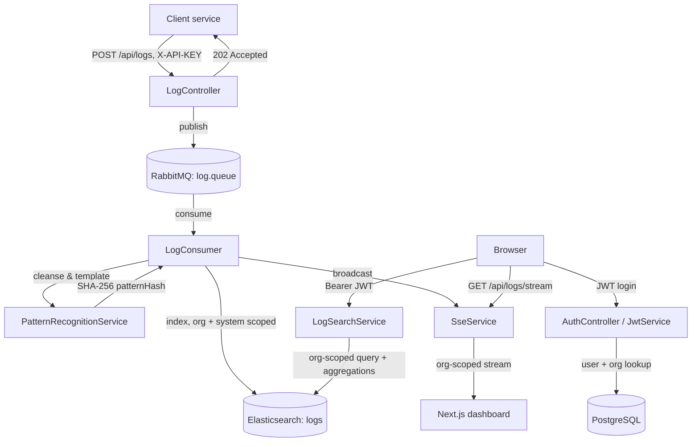

# 📊 LogMetric

[](https://www.oracle.com/java/)
[](https://spring.io/projects/spring-boot)
[](https://nextjs.org/)
[](https://react.dev/)
[](https://www.rabbitmq.com/)
[](https://www.elastic.co/)
[](https://www.postgresql.org/)

LogMetric is a **multi-tenant log telemetry platform**: organizations ingest log events over a
hashed API key, the backend clusters them by structural pattern (a SHA-256 hash of each message
with its variables stripped out) using an asynchronous RabbitMQ → Elasticsearch pipeline, and a
full Next.js dashboard streams them back in real time — search, pattern clusters, live tail, and
team management, all scoped strictly to the caller's own organization.

It started as a small ingestion API and grew into a full-stack product: JWT + API-key auth,
role-based access control, invite-based team onboarding, and a from-scratch three-theme frontend
(Midnight / Daylight / Amber CRT) covering nine routes, audited to zero axe-core accessibility
violations and responsive from 375px to 1920px.

---

## 🏗️ Architecture


```mermaid
graph TD
    Client[Client service] -->|POST /api/logs, X-API-KEY| LC[LogController]
    LC -->|202 Accepted| Client
    LC -->|publish| RMQ[(RabbitMQ: log.queue)]

    RMQ -->|consume| LCons[LogConsumer]
    LCons -->|cleanse & template| PRS[PatternRecognitionService]
    PRS -->|SHA-256 patternHash| LCons
    LCons -->|index, org + system scoped| ES[(Elasticsearch: logs)]
    LCons -->|broadcast| SSE[SseService]

    SSE -->|org-scoped stream| UI[Next.js dashboard]

    Browser[Browser] -->|JWT login| Auth[AuthController / JwtService]
    Auth -->|user + org lookup| PG[(PostgreSQL)]
    Browser -->|Bearer JWT| Search[LogSearchService]
    Search -->|org-scoped query + aggregations| ES
    Browser -->|GET /api/logs/stream| SSE
```

1. **Ingestion.** A client posts a log with an `X-API-KEY` header. The key is validated (hashed
   comparison, never stored or compared in plaintext) and resolves to an `organizationId` —
   which the client can never override — before the request is queued to RabbitMQ and
   acknowledged in milliseconds.
2. **Processing.** `LogConsumer` picks the message off the queue, strips variables (numbers, IDs)
   from the message via `PatternRecognitionService` to produce a structural template, and hashes
   that template with SHA-256 into a `patternHash`. Logs with the same shape — regardless of the
   specific numbers inside — land in the same cluster.
3. **Storage & fan-out.** The enriched entry is indexed into Elasticsearch (org- and
   system-scoped) and simultaneously broadcast over an org-keyed `SseService` channel, so a
   connected dashboard sees it within the same request, not on the next poll.
4. **Query.** `LogSearchService` builds every query with an org filter derived server-side from
   the authenticated principal — never from a client-supplied parameter — plus optional keyword,
   level, service, pattern-hash, and time-range filters, and returns a date histogram, severity
   distribution, service breakdown, and pattern-cluster aggregation alongside the matched logs.
5. **Auth.** Two independent principal types share one security filter chain: a JWT (`Bearer`)
   for browser sessions, and a hashed API key (`X-API-KEY`) for log ingestion. Roles
   (`ADMIN`/`USER`) are read fresh from the database on every request, not decoded from the JWT,
   so a role change takes effect on the very next request without a re-login.

---

## 🛠️ Technology Stack

**Backend**
- Spring Boot 4.0.6 (Web MVC, Security, Data JPA, Data Elasticsearch)
- PostgreSQL — organizations, users, invites, API keys
- Elasticsearch — log storage, full-text search, aggregations
- RabbitMQ — async ingestion queue
- JWT (HS384) for session auth; SHA-256-hashed API keys for ingestion auth
- No Lombok — explicit getters/setters throughout; constructor injection only

**Frontend** (`logmetric-ui/`)
- Next.js 16 (App Router) · React 19 · TypeScript
- Tailwind v4 utilities + CSS custom properties for theming (no component library)
- `lucide-react` for icons — otherwise zero runtime UI dependencies
- Server-Sent Events read via a manual `fetch()` stream reader (native `EventSource` can't attach
  an `Authorization` header), with automatic reconnect on a dropped connection

---

## 📂 Project Structure

```
LogMetric/
├── src/main/java/org/example/logmetricapi/
│   ├── config/          SecurityConfig, ElasticsearchConfig, RabbitConfig, PasswordConfig
│   ├── consumer/        LogConsumer -- RabbitMQ listener, pattern hashing, ES indexing
│   ├── controller/      AuthController, LogController, ApiKeyController,
│   │                    InviteController, UserController, GlobalExceptionHandler
│   ├── dto/             Request/response records for every endpoint
│   ├── model/           User, Organization, Role, ApiKey, InviteToken, LogEntry
│   ├── repository/      Spring Data JPA + Elasticsearch repositories
│   ├── scheduler/       AlertScheduler (anomaly detection sweep -- console-only today)
│   ├── security/        JwtAuthFilter, ApiKeyAuthFilter
│   ├── service/         LogSearchService, PatternRecognitionService, JwtService,
│   │                    InviteService, LogAnalyticsService, SseService, DatabaseSeeder
│   └── util/            AuthUtils (principal → organizationId resolution), HashUtil
├── src/main/resources/application.properties
├── docker-compose.yml   Postgres · RabbitMQ · Elasticsearch
└── logmetric-ui/
    └── app/
        ├── page.tsx, signin/, signup/                     public routes
        ├── dashboard/, explorer/, patterns/,
        │   alerts/, settings/, team/                       authenticated routes
        ├── components/{ui,charts,explorer,patterns,settings,team}/
        └── lib/         api.ts, auth.tsx, theme.tsx, useLogSearch.ts, useMediaQuery.ts
```

---

## 🚀 Setup & Installation

### 1. Start infrastructure
```bash
docker compose up -d      # Postgres :5432, RabbitMQ :5672 (+:15672 UI), Elasticsearch :9200
```

### 2. Configure environment
Set a strong `JWT_SECRET` (≥32 bytes, raw UTF-8 — not Base64) — the app fails fast at startup
without one in any environment beyond local dev:
```bash
export JWT_SECRET=$(openssl rand -hex 32)
```
Database credentials live in `src/main/resources/application.properties`.

### 3. Run the backend
```bash
./mvnw spring-boot:run    # :8081
```
On first boot against an empty database, `DatabaseSeeder` prints a ready-to-use admin login
(`admin@logmetric.local` / `admin12345` by default, overridable via `SEED_ADMIN_PASSWORD`) and a
seeded API key. It's disabled outside the `!prod` profile.

### 4. Run the frontend
```bash
cd logmetric-ui
npm install
npm run dev                # :3000, reads NEXT_PUBLIC_API_URL from .env.local
```
Copy `.env.example` to `.env.local` first. Leave `NEXT_PUBLIC_DEMO_MODE` unset or `false` for a
real deployment against the backend above — it's provided only for a static marketing preview
with no backend and synthetic data.

---

## ✨ What's built

- **Multi-tenancy, enforced server-side on every read path.** Search, live streaming, and every
  aggregation filter on the organization derived from the authenticated principal. No endpoint
  accepts an org ID from the client.
- **Auth & onboarding.** JWT login/register, duplicate-email and weak-org-name protection,
  invite-token-based team onboarding (a second person can only join an org via an admin-issued
  invite — open "join by org name" was a real vulnerability, closed early on).
- **RBAC.** `ADMIN`/`USER` roles gate key generation, invites, and role changes, enforced via
  `@PreAuthorize` and re-checked fresh from the database on every request.
- **Ingestion pipeline.** API-key-authenticated `POST /api/logs`, org/system stamped server-side,
  async via RabbitMQ, SHA-256 pattern-clustered on the way into Elasticsearch.
- **Search & analytics.** Keyword, level, service, pattern-hash, and time-range filters; a date
  histogram whose bucket width (and axis label) scales with the requested span; severity and
  service-name aggregations; brush-to-zoom on the histogram.
- **Pattern clustering UI.** A dedicated `/patterns` view groups events by structural template —
  "342 events across 4 services," not 342 near-identical rows — with per-cluster drill-down.
- **Real-time live tail.** Org-scoped Server-Sent Events with scroll anchoring (new rows don't
  yank you away from what you're reading), pause/buffer, and automatic reconnect with capped
  exponential backoff if the connection drops.
- **Team management.** Invite teammates, promote/demote admins, with every guard condition (can't
  demote yourself, can't demote the org's last admin, cross-org IDs 404 rather than leaking
  existence) surfaced as a specific message.
- **Settings.** Self-service API key generation with a ready-to-run curl snippet — the raw key is
  shown exactly once, since it's stored hashed and cannot be retrieved again.
- **Frontend polish.** Three complete themes with a validated, colour-vision-deficiency-checked
  status palette; a command palette (Ctrl+K); responsive from 375px to 1920px, including a
  bottom-sheet presentation for drawers/filters on mobile; virtualized log tables above 200 rows;
  zero axe-core accessibility violations across all routes and themes; honest empty/loading/error
  states everywhere (a dead backend is never visually indistinguishable from an empty org).

## 🚧 Not yet built

- **Real alerting.** Anomaly detection (EMA z-score, Shannon entropy) runs and logs to console;
  there's no `AlertRule` persistence, no email/SSE delivery, and no rule editor. `/alerts` is an
  honest, clearly-labelled placeholder explaining what's planned, not a stub pretending to work.
- **System/topology hierarchy.** Logs carry a `systemId`, but there's no `System` entity, no
  per-system API keys, and no topology view yet — organizations are currently the only real
  tenant boundary.
- **Email verification & password reset.** Not implemented; registration and login work without
  either today.
- **Audit log.** No record of admin actions (invites issued, roles changed, keys generated) yet.

---

## 🔌 API Reference

All endpoints are under `/api`. JWT endpoints expect `Authorization: Bearer <token>`; ingestion
uses `X-API-KEY: <key>` instead.

| Method | Path | Auth | Purpose |
|---|---|---|---|
| POST | `/auth/register` | none | Create an org + admin user |
| POST | `/auth/register-with-invite` | none | Join an org via invite code, as `USER` |
| POST | `/auth/login` | none | Returns a JWT |
| GET | `/auth/me` | JWT | Current user's fresh role/org (not the JWT's stale claim) |
| POST | `/logs` | API key | Ingest one log event (202 Accepted) |
| POST | `/logs/search` | JWT | Org-scoped search + aggregations |
| GET | `/logs/stream` | JWT | Org-scoped SSE live tail |
| POST | `/keys/generate` | JWT, `ADMIN` | Generate an API key (shown once) |
| POST | `/invites` | JWT, `ADMIN` | Generate a 7-day single-use invite code |
| GET | `/users` | JWT, `ADMIN` | List the caller's org members |
| PATCH | `/users/{id}/role` | JWT, `ADMIN` | Promote or demote a teammate |

### Example: ingest a log
```bash
curl -X POST http://localhost:8081/api/logs \
  -H "X-API-KEY: <your-api-key>" \
  -H "Content-Type: application/json" \
  -d '{"level":"ERROR","serviceName":"auth-service","message":"Failed login for user 4983 from 192.168.1.1"}'
```
The message above and one for user `9021` from a different IP both hash to the same
`patternHash` — the numbers are template variables, not part of the pattern's identity.

---

## 🔒 Security

- **Two independent auth mechanisms**, both enforced in one Spring Security filter chain: JWT
  (HS384, ≥32-byte secret required at startup) for the dashboard, hashed API keys for ingestion.
- **Every read is org-scoped server-side.** `AuthUtils` resolves the caller's `organizationId`
  from the authenticated principal — never from a request parameter — and every controller,
  service query, and SSE subscription is required to use it.
- **RBAC via `hasAuthority`, not `hasRole`** — `User.getAuthorities()` returns bare `ADMIN`/`USER`
  with no `ROLE_` prefix, so `hasRole(...)` would silently never match.
- **Clean 401/403 bodies** from a dedicated `AuthenticationEntryPoint`/`AccessDeniedHandler` pair,
  including for malformed or tampered JWTs (caught explicitly, not left to crash as a 500).
- **Cross-org lookups 404, not 403** — a user/invite ID from another org reads as "not found," not
  "forbidden," so an attacker can't use the response to confirm an ID exists elsewhere.
- Automated tenant-isolation and RBAC regression tests run as part of `./mvnw verify`.

---

## 🧪 Tests

```bash
./mvnw verify
```
Includes `TenantIsolationIT` (two orgs, two API keys — asserts one can never read the other's
data via search, `GET`, or SSE) and `RbacIT` (asserts every `ADMIN`-gated endpoint 403s a `USER`
JWT and an API-key principal, and succeeds for `ADMIN`).

---

## 📈 Roadmap

Real alert rules + delivery (SMTP, dedup/cooldown), a `System`/topology entity with per-system API
keys, email verification and password reset (OTP-based), and an audit log are scoped but not yet
built — see the project's internal planning docs for the full task breakdown.
