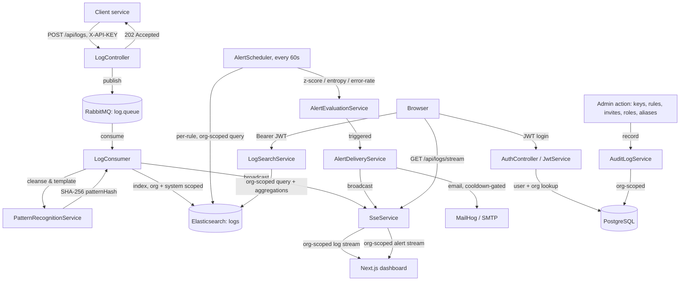

# 📊 LogMetric

[](https://www.oracle.com/java/)
[](https://spring.io/projects/spring-boot)
[](https://nextjs.org/)
[](https://react.dev/)
[](https://www.rabbitmq.com/)
[](https://www.elastic.co/)
[](https://www.postgresql.org/)

LogMetric is a **multi-tenant log telemetry platform**: organizations ingest log events over a
hashed, per-system API key, the backend clusters them by structural pattern (a SHA-256 hash of
each message with its variables stripped out) using an asynchronous RabbitMQ → Elasticsearch
pipeline, and a full Next.js dashboard streams them back in real time — search, pattern clusters,
live tail, real anomaly-based alerting, and team management, all scoped strictly to the caller's
own organization.

It started as a small ingestion API and grew into a full-stack product: JWT + API-key auth,
role-based access control, invite-based team onboarding with OTP email verification and
self-service password reset, a true `Organization → System → ApiKey` tenant hierarchy, rule-driven
alerting with real email/SSE delivery, an admin audit log, and a from-scratch three-theme frontend
(Midnight / Daylight / Amber CRT) covering ten routes, audited to zero axe-core accessibility
violations and responsive from 375px to 1920px.

---

## 🏗️ Architecture


```mermaid
graph TD
    Client[Client service] -->|POST /api/logs, X-API-KEY| LC[LogController]
    LC -->|202 Accepted| Client
    LC -->|publish| RMQ[(RabbitMQ: log.queue)]

    RMQ -->|consume| LCons[LogConsumer]
    LCons -->|cleanse & template| PRS[PatternRecognitionService]
    PRS -->|SHA-256 patternHash| LCons
    LCons -->|index, org + system scoped| ES[(Elasticsearch: logs)]
    LCons -->|broadcast| SSE[SseService]

    SSE -->|org-scoped log stream| UI[Next.js dashboard]

    Sched[AlertScheduler, every 60s] -->|per-rule, org-scoped query| ES
    Sched -->|z-score / entropy / error-rate| AES[AlertEvaluationService]
    AES -->|triggered| ADS[AlertDeliveryService]
    ADS -->|email, cooldown-gated| Mail[MailHog / SMTP]
    ADS -->|broadcast| SSE
    SSE -->|org-scoped alert stream| UI

    Browser[Browser] -->|JWT login| Auth[AuthController / JwtService]
    Auth -->|user + org lookup| PG[(PostgreSQL)]
    Browser -->|Bearer JWT| Search[LogSearchService]
    Search -->|org-scoped query + aggregations| ES
    Browser -->|GET /api/logs/stream| SSE

    Admin[Admin action: keys, rules, invites, roles, aliases] -->|record| Audit[AuditLogService]
    Audit -->|org-scoped| PG
```

1. **Ingestion.** A client posts a log with an `X-API-KEY` header. The key is validated (hashed
   comparison, never stored or compared in plaintext) and resolves to both an `organizationId`
   **and** a `systemId` — a key belongs to one `System` under one `Organization` — which the
   client can never override, before the request is queued to RabbitMQ and acknowledged in
   milliseconds.
2. **Processing.** `LogConsumer` picks the message off the queue, strips variables (numbers, IDs)
   from the message via `PatternRecognitionService` to produce a structural template, and hashes
   that template with SHA-256 into a `patternHash`. Logs with the same shape — regardless of the
   specific numbers inside — land in the same cluster.
3. **Storage & fan-out.** The enriched entry is indexed into Elasticsearch (org- and
   system-scoped) and simultaneously broadcast over an org-keyed `SseService` channel, so a
   connected dashboard sees it within the same request, not on the next poll.
4. **Query.** `LogSearchService` builds every query with an org filter derived server-side from
   the authenticated principal — never from a client-supplied parameter — plus optional keyword,
   level, service, pattern-hash, and time-range filters, and returns a date histogram, severity
   distribution, service breakdown, and pattern-cluster aggregation alongside the matched logs.
5. **Alerting.** Every 60 seconds, `AlertScheduler` iterates each organization's enabled
   `AlertRule`s and asks `AlertEvaluationService` to run an org-scoped Elasticsearch query over
   that rule's own window, evaluating one of three metrics: `ERROR_RATE`, an EMA-based
   `VOLUME_ZSCORE`, or Shannon-entropy-based `ENTROPY` (obfuscated-payload detection). A triggered
   rule goes through `AlertDeliveryService`, which sends exactly one email (every recipient in a
   single `To` header) and one event on an org-scoped `alerts` SSE channel, gated by a configurable
   cooldown so a sustained incident produces one notification, not one per tick.
6. **Auth.** Two independent principal types share one security filter chain: a JWT (`Bearer`)
   for browser sessions, and a hashed API key (`X-API-KEY`) for log ingestion. Roles
   (`ADMIN`/`USER`) are read fresh from the database on every request, not decoded from the JWT,
   so a role change takes effect on the very next request without a re-login.
7. **Audit.** Every login and admin-facing mutation (API keys, systems, alert rules, invites, role
   changes, org rename, password changes, service aliases) is recorded into an org-scoped
   `AuditLog`, readable only by an admin of that org, with a caller-chosen retention purge.

---

## 🛠️ Technology Stack

**Backend**
- Spring Boot 4.0.6 (Web MVC, Security, Data JPA, Data Elasticsearch, Mail)
- PostgreSQL — organizations, systems, users, invites, API keys, alert rules, OTP codes, audit log
- Elasticsearch — log storage, full-text search, aggregations
- RabbitMQ — async ingestion queue
- JWT (HS384) for session auth; SHA-256-hashed API keys for ingestion auth
- MailHog (dev) / SMTP — OTP-based email verification, password reset, and alert delivery
- No Lombok — explicit getters/setters throughout; constructor injection only

**Frontend** (`logmetric-ui/`)
- Next.js 16 (App Router) · React 19 · TypeScript
- Tailwind v4 utilities + CSS custom properties for theming (no component library)
- `lucide-react` for icons — otherwise zero runtime UI dependencies
- Server-Sent Events read via a manual `fetch()` stream reader (native `EventSource` can't attach
  an `Authorization` header), with automatic reconnect on a dropped connection

---

## 📂 Project Structure

```
LogMetric/
├── src/main/java/org/example/logmetricapi/
│   ├── config/          SecurityConfig, ElasticsearchConfig, RabbitConfig, PasswordConfig
│   ├── consumer/        LogConsumer -- RabbitMQ listener, pattern hashing, ES indexing
│   ├── controller/      AuthController, LogController, SystemController, ApiKeyController,
│   │                    AlertRuleController, AlertStreamController, InviteController,
│   │                    UserController, OrganizationController, ServiceAliasController,
│   │                    AuditLogController, GlobalExceptionHandler
│   ├── dto/             Request/response records for every endpoint
│   ├── model/           User, Organization, SystemEntity, Role, ApiKey, ApiKeyPrincipal,
│   │                    InviteToken, AlertRule, AlertMetric, OtpToken, OtpPurpose, ServiceAlias,
│   │                    AuditLog, AuditAction, LogEntry
│   ├── repository/      Spring Data JPA + Elasticsearch repositories
│   ├── scheduler/       AlertScheduler -- rule-driven, org-scoped anomaly evaluation every 60s
│   ├── security/        JwtAuthFilter, ApiKeyAuthFilter
│   ├── service/         LogSearchService, LogAnalyticsService, PatternRecognitionService,
│   │                    JwtService, ApiKeyService, InviteService, OtpService, MailService,
│   │                    AlertEvaluationService, AlertDeliveryService, AuditLogService,
│   │                    SseService, CustomUserDetailsService, DatabaseSeeder
│   └── util/            AuthUtils (principal → organizationId/systemId/User resolution), HashUtil
├── src/main/resources/application.properties
├── docker-compose.yml   Postgres · RabbitMQ · Elasticsearch · MailHog
└── logmetric-ui/
    └── app/
        ├── page.tsx, signin/, signup/,
        │   forgot-password/, reset-password/,
        │   verify-email/, terms/, privacy/            public routes
        ├── dashboard/, explorer/, patterns/,
        │   alerts/, settings/, team/, audit/           authenticated routes
        ├── components/{ui,charts,explorer,patterns,alerts,settings,team}/
        └── lib/         api.ts, auth.tsx, theme.tsx, useLogSearch.ts, useMediaQuery.ts
```

---

## 🚀 Setup & Installation

### 1. Start infrastructure
```bash
docker compose up -d      # Postgres :5432, RabbitMQ :5672 (+:15672 UI), Elasticsearch :9200,
                           # MailHog :1025 (SMTP) / :8025 (web UI -- inspect OTP/alert emails here)
```

### 2. Configure environment
Set a strong `JWT_SECRET` (≥32 bytes, raw UTF-8 — not Base64) — the app fails fast at startup
without one, in every environment including local dev:
```bash
export JWT_SECRET=$(openssl rand -hex 32)
```
Database credentials and mail settings live in `src/main/resources/application.properties`
(defaults already point at the MailHog container above for local dev).

### 3. Run the backend
```bash
./mvnw spring-boot:run    # :8081
```
On first boot against an empty database, `DatabaseSeeder` prints a ready-to-use admin login
(`admin@logmetric.local` / `admin12345` by default, overridable via `SEED_ADMIN_PASSWORD`) and a
seeded API key. The seeded admin's email is pre-verified, so it skips the OTP step every other
account goes through. Disabled outside the `!prod` profile.

### 4. Run the frontend
```bash
cd logmetric-ui
npm install
npm run dev                # :3000, reads NEXT_PUBLIC_API_URL from .env.local
```
Copy `.env.example` to `.env.local` first. Leave `NEXT_PUBLIC_DEMO_MODE` unset or `false` for a
real deployment against the backend above — it's provided only for a static marketing preview
with no backend and synthetic data.

---

## ✨ What's built

- **Multi-tenancy, enforced server-side on every read path.** Search, live streaming, and every
  aggregation filter on the organization derived from the authenticated principal. A true
  `Organization → System → ApiKey` hierarchy means every ingested log also carries a server-derived
  `systemId` a client can never override; System CRUD is admin-gated for writes, org-wide for reads.
- **Auth & onboarding.** JWT login/register, duplicate-email and weak-org-name protection,
  invite-token-based team onboarding (a second person can only join an org via an admin-issued
  invite — open "join by org name" was a real vulnerability, closed early on), with a full
  list/revoke lifecycle for outstanding invites.
- **OTP-based email verification & password reset.** Both signup paths require a 6-digit, emailed,
  BCrypt-hashed, single-use code before login is allowed (10-minute expiry, 5-attempt cap, 60s
  resend cooldown); forgot/reset-password reuses the same infrastructure with enumeration-resistant
  responses. Logged-in users can also change their password directly, and admins can rename their
  organization inline.
- **RBAC.** `ADMIN`/`USER` roles gate every mutating endpoint (keys, systems, alert rules, invites,
  role changes, org rename, service aliases, audit log), enforced via `@PreAuthorize` and
  re-checked fresh from the database on every request.
- **Ingestion pipeline.** API-key-authenticated `POST /api/logs`, org/system stamped server-side,
  async via RabbitMQ, SHA-256 pattern-clustered on the way into Elasticsearch.
- **Search & analytics.** Keyword, level, service, pattern-hash, and time-range filters; a date
  histogram whose bucket width (and axis label) scales with the requested span; severity and
  service-name aggregations; brush-to-zoom on the histogram; admin-editable display aliases for
  the free-text service names logs actually carry.
- **Real alerting.** Org-scoped `AlertRule`s (error rate, EMA z-score volume spikes, Shannon-entropy
  payload obfuscation), each with its own threshold, window, and recipient list validated against
  real org members. A rule-driven scheduler evaluates every 60s and delivers through email (single
  digest, cooldown-gated) and a live SSE feed. A real rule editor on `/alerts` gives admins full
  CRUD, enable/disable, and a recipient multi-select — not a placeholder.
- **Pattern clustering UI.** A dedicated `/patterns` view groups events by structural template —
  "342 events across 4 services," not 342 near-identical rows — with per-cluster drill-down.
- **Real-time live tail.** Org-scoped Server-Sent Events with scroll anchoring (new rows don't
  yank you away from what you're reading), pause/buffer, and automatic reconnect with capped
  exponential backoff if the connection drops.
- **Team management.** Invite teammates, promote/demote admins, list/revoke outstanding invites,
  with every guard condition (can't demote yourself, can't demote the org's last admin, cross-org
  IDs 404 rather than leaking existence) surfaced as a specific message.
- **Audit log.** Every login and admin action is recorded org-scoped and readable on `/audit`
  (paginated), with an admin-controlled retention purge — no silent background sweep.
- **Settings.** Self-service API key generation with a ready-to-run curl snippet (the raw key is
  shown exactly once, since it's stored hashed and cannot be retrieved again) plus a list of
  existing keys' metadata; organization rename; password change; service display aliases.
- **Frontend polish.** Three complete themes with a validated, colour-vision-deficiency-checked
  status palette; a command palette (Ctrl+K); responsive from 375px to 1920px, including a
  bottom-sheet presentation for drawers/filters on mobile; virtualized log tables above 200 rows;
  zero axe-core accessibility violations across all routes and themes; honest empty/loading/error
  states everywhere (a dead backend is never visually indistinguishable from an empty org).

## 🚧 Not yet built

- **A true Topology page.** Logs and API keys are already scoped by a real `System` entity with
  full CRUD (`/api/systems`), but there's no dedicated frontend view visualizing the
  `Organization → System` hierarchy itself — Settings' API key flow uses it transparently instead.
- **Per-user system monitoring assignment.** Unblocked (Systems exist) but explicitly deprioritized:
  narrowing read access from "whole org" to "assigned systems only" would need to be enforced in
  every read path (search, SSE, every aggregation), and a half-applied version of that is worse
  than not having it.

---

## 🔌 API Reference

All endpoints are under `/api`. JWT endpoints expect `Authorization: Bearer <token>`; ingestion
uses `X-API-KEY: <key>` instead.

| Method | Path | Auth | Purpose |
|---|---|---|---|
| POST | `/auth/register` | none | Create an org + admin user; issues an email verification code |
| POST | `/auth/register-with-invite` | none | Join an org via invite code as `USER`; same verification |
| POST | `/auth/verify-email` | none | Confirm the 6-digit signup code; returns a JWT |
| POST | `/auth/resend-verification` | none | New code, subject to a 60s cooldown |
| POST | `/auth/login` | none | Returns a JWT (403 if the account isn't verified yet) |
| POST | `/auth/forgot-password` | none | Always 200; issues a reset code if the address is registered |
| POST | `/auth/reset-password` | none | Resets the password with a valid code |
| POST | `/auth/change-password` | JWT | Change your own password (requires the current one) |
| GET | `/auth/me` | JWT | Current user's fresh role/org (not the JWT's stale claim) |
| PATCH | `/organizations` | JWT, `ADMIN` | Rename the caller's own organization |
| POST | `/logs` | API key | Ingest one log event (202 Accepted) |
| POST | `/logs/search` | JWT | Org-scoped search + aggregations |
| GET | `/logs/stream` | JWT | Org-scoped SSE live tail |
| POST | `/systems` | JWT, `ADMIN` | Create a system |
| GET | `/systems` | JWT | List the org's systems |
| DELETE | `/systems/{id}` | JWT, `ADMIN` | Delete a system |
| POST | `/systems/{id}/keys` | JWT, `ADMIN` | Generate an API key for a system (shown once) |
| GET | `/keys` | JWT, `ADMIN` | List key metadata (masked hint, system, revoked) |
| GET | `/alert-rules` | JWT, `ADMIN` | List the org's alert rules |
| POST | `/alert-rules` | JWT, `ADMIN` | Create a rule |
| PUT | `/alert-rules/{id}` | JWT, `ADMIN` | Replace a rule |
| DELETE | `/alert-rules/{id}` | JWT, `ADMIN` | Delete a rule |
| GET | `/alerts/stream` | JWT | Org-scoped SSE feed of triggered alerts |
| POST | `/invites` | JWT, `ADMIN` | Generate a 7-day single-use invite code |
| GET | `/invites` | JWT, `ADMIN` | List outstanding invites |
| DELETE | `/invites/{id}` | JWT, `ADMIN` | Revoke an unredeemed invite |
| GET | `/users` | JWT, `ADMIN` | List the caller's org members |
| PATCH | `/users/{id}/role` | JWT, `ADMIN` | Promote or demote a teammate |
| GET | `/service-aliases` | JWT | List the org's service display aliases |
| PUT | `/service-aliases` | JWT, `ADMIN` | Set or replace a service's display alias |
| DELETE | `/service-aliases` | JWT, `ADMIN` | Clear a service's display alias |
| GET | `/audit-logs` | JWT, `ADMIN` | Paginated, org-scoped audit history |
| DELETE | `/audit-logs` | JWT, `ADMIN` | Purge audit entries older than `olderThanDays` |

### Example: ingest a log
```bash
curl -X POST http://localhost:8081/api/logs \
  -H "X-API-KEY: <your-api-key>" \
  -H "Content-Type: application/json" \
  -d '{"level":"ERROR","serviceName":"auth-service","message":"Failed login for user 4983 from 192.168.1.1"}'
```
The message above and one for user `9021` from a different IP both hash to the same
`patternHash` — the numbers are template variables, not part of the pattern's identity.

---

## 🔒 Security

- **Two independent auth mechanisms**, both enforced in one Spring Security filter chain: JWT
  (HS384, ≥32-byte secret required at startup) for the dashboard, hashed API keys for ingestion.
- **Every read is org-scoped server-side.** `AuthUtils` resolves the caller's `organizationId`
  (and, for API keys, `systemId`) from the authenticated principal — never from a request
  parameter — and every controller, service query, and SSE subscription is required to use it.
- **RBAC via `hasAuthority`, not `hasRole`** — `User.getAuthorities()` returns bare `ADMIN`/`USER`
  with no `ROLE_` prefix, so `hasRole(...)` would silently never match.
- **OTP hygiene.** Signup and password-reset codes are 6-digit, `SecureRandom`-generated, BCrypt-
  hashed, single-use, capped at 5 attempts, and rate-limited by a 60s resend cooldown. Every
  enumeration-sensitive endpoint (`resend-verification`, `forgot-password`) returns an identical
  response regardless of whether the address exists.
- **Clean 401/403 bodies** from a dedicated `AuthenticationEntryPoint`/`AccessDeniedHandler` pair,
  including for malformed or tampered JWTs (caught explicitly, not left to crash as a 500).
- **Cross-org lookups 404, not 403** — a user/invite/system/rule ID from another org reads as "not
  found," not "forbidden," so an attacker can't use the response to confirm an ID exists elsewhere.
- **Recipient validation on alert rules.** A rule's email recipients must belong to a real member
  of the caller's own org, rejected by name otherwise — closing what would be an open relay for
  exfiltrating alert content (which can include log excerpts).
- **Audit trail.** Every login and admin mutation is recorded org-scoped, so "who generated this key"
  or "who changed this role" has an answer.
- Automated tenant-isolation and RBAC regression tests run as part of `./mvnw verify`.

---

## 🧪 Tests

```bash
./mvnw verify
```
63 tests across dependency-free unit tests (`JwtServiceTests`, `PatternRecognitionServiceTests`,
`LogAnalyticsServiceTests`) and full-stack integration tests requiring `docker compose up -d`:
`TenantIsolationAndRbacTests` (two orgs, two API keys — asserts one can never read the other's data
via search, SSE, or any admin endpoint; every `ADMIN`-gated endpoint 403s a `USER` JWT and an
API-key principal, 200s an `ADMIN`), `EmailVerificationTests`, `ForgotPasswordTests`,
`ChangePasswordTests`, `OrganizationRenameTests`, `ServiceAliasTests`, `AlertRuleTests`,
`AlertEvaluationAndDeliveryTests`, and `AuditLogTests`.

---

## 📈 Roadmap

What's left is narrow: a dedicated Topology page visualizing the `Organization → System` hierarchy
(the backend and API have supported it since Phase 1; there's just no frontend view for it yet),
and per-user system monitoring assignment — unblocked but deliberately deprioritized, since a
half-applied second scoping layer would be worse than the current, fully-tested org-level boundary.
See the project's internal planning docs for the full task-by-task history.
