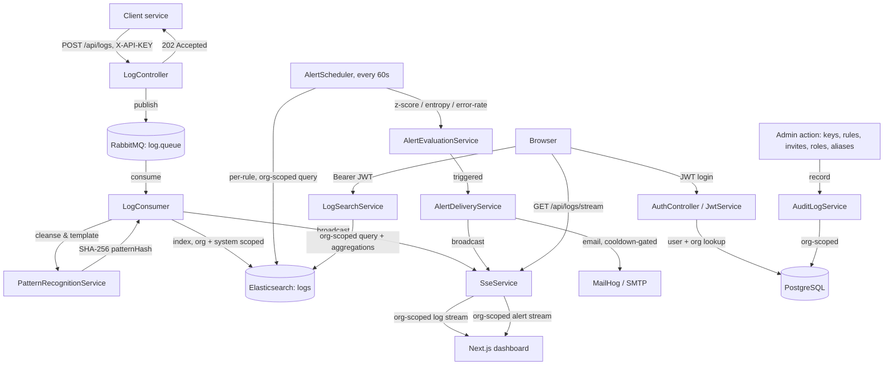

# 🏗️ Architecture

## System Flow
1. **Ingestion.** A client posts a log with an `X-API-KEY` header. The key is validated (hashed comparison, never stored or compared in plaintext) and resolves to both an `organizationId` **and** a `systemId` — a key belongs to one `System` under one `Organization` — which the client can never override, before the request is queued to RabbitMQ and acknowledged in milliseconds.
2. **Processing.** `LogConsumer` picks the message off the queue, strips variables (numbers, IDs) from the message via `PatternRecognitionService` to produce a structural template, and hashes that template with SHA-256 into a `patternHash`. Logs with the same shape — regardless of the specific numbers inside — land in the same cluster.
3. **Storage & fan-out.** The enriched entry is indexed into Elasticsearch (org- and system-scoped) and simultaneously broadcast over an org-keyed `SseService` channel, so a connected dashboard sees it within the same request, not on the next poll.
4. **Query.** `LogSearchService` builds every query with an org filter derived server-side from the authenticated principal — never from a client-supplied parameter — plus optional keyword, level, service, pattern-hash, and time-range filters, and returns a date histogram, severity distribution, service breakdown, and pattern-cluster aggregation alongside the matched logs.
5. **Alerting.** Every 60 seconds, `AlertScheduler` iterates each organization's enabled `AlertRule`s and asks `AlertEvaluationService` to run an org-scoped Elasticsearch query over that rule's own window, evaluating one of six metrics: `ERROR_RATE`, an EMA-based `VOLUME_ZSCORE`, Shannon-entropy-based `ENTROPY` (obfuscated-payload detection), `NEW_PATTERN`, `PATTERN_SILENCE`, or `PARAM_CARDINALITY` (parameter cardinality anomalies). A triggered rule goes through `AlertDeliveryService`, which sends exactly one email (every recipient in a single `To` header) and one event on an org-scoped `alerts` SSE channel, gated by a configurable cooldown so a sustained incident produces one notification, not one per tick.
6. **Auth.** Two independent principal types share one security filter chain: a JWT (`Bearer`) for browser sessions, and a hashed API key (`X-API-KEY`) for log ingestion. Roles (`ADMIN`/`USER`) are read fresh from the database on every request, not decoded from the JWT, so a role change takes effect on the very next request without a re-login.
7. **Audit.** Every login and admin-facing mutation (API keys, systems, alert rules, invites, role changes, org rename, password changes, service aliases) is recorded into an org-scoped `AuditLog`, readable only by an admin of that org, with a caller-chosen retention purge.

## Technology Stack

**Backend**
- Spring Boot 4.0.6 (Web MVC, Security, Data JPA, Data Elasticsearch, Mail, Scheduling)
- PostgreSQL — organizations, systems, users, invites, API keys, alert rules, OTP codes, audit log, log patterns, parameter stats
- Elasticsearch — log storage, full-text search, aggregations, pattern clustering
- RabbitMQ — async ingestion queue
- JWT (HS384) for session auth; SHA-256-hashed API keys for ingestion auth
- MailHog (dev) / SMTP — OTP-based email verification, password reset, and alert delivery
- In-memory concurrent rate-limiting for login brute-force protection and parameter cardinality tracking

**Frontend**
- Next.js 16 (App Router) · React 19 · TypeScript
- Tailwind v4 utilities + CSS custom properties for theming (no component library)
- `lucide-react` for icons — otherwise zero runtime UI dependencies
- Server-Sent Events read via a manual `fetch()` stream reader (native `EventSource` can't attach an `Authorization` header), with automatic reconnect on a dropped connection
